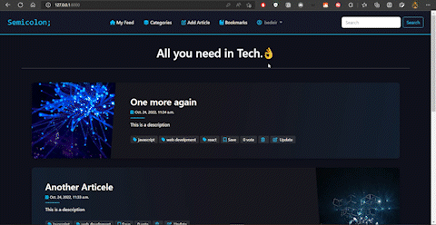
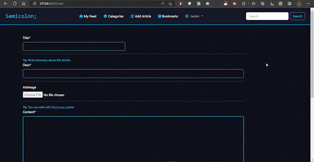
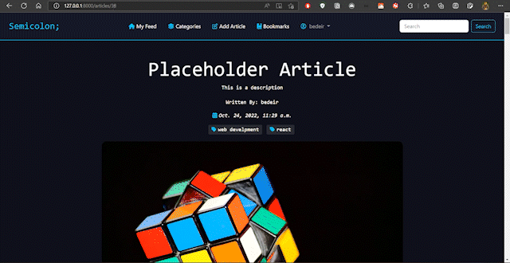
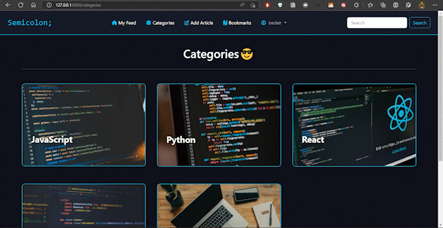
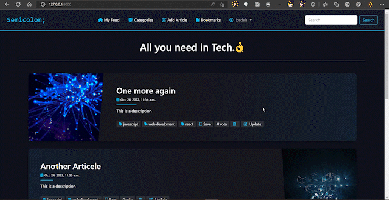
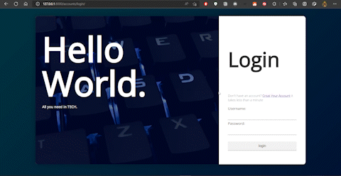

<div align="center">
  <br>
  <a href="#"></a>
  <h1>Semicolon</h1>
</div>

<h4 align="center">Full-Featured blog built-in by Django and Bootstrap.</h4>

<p align="center">
  <a href="https://python.org/downloads/">
    
  </a>
  <a href="https://djangoproject.com/">
    
  </a>
  <a href="https://choosealicense.com/licenses/gpl-3.0/">
    
  </a>
</p>
<p align="center">
  <a href="#overview">Overview</a> •
  <a href="#describe">Folders</a> •
  <a href="#key-features">Key Features</a> •
  <a href="#how-to-use">Run Locally</a> •
  <a href="#views">Urls & Views</a> •
  <a href="#todo">TODO</a> •
  <a href="#author">Author</a> 
</p>

<!--  -->

<a name = "overview"></a>

# Overview

This is a project which was developed for the CS50 web course final project. The application contained within is a CMS-style blog site where developers can publish their blog articles and comment on other developers' articles in addition to other options.


Here is the Demo 👇


https://github.com/AhmedBedeir/django-blog/assets/66643588/0b8bd12b-0da4-4bbc-b8c4-5d322f5d04d9


<!-- Here is the [demo](https://www.youtube.com/watch?v=8sMxsItJub0). -->

<a name = "describe"></a>

# What’s contained in each folder

- accounts:
  - this app is manage users' accounts (login - logout - register - etc.)
  - [Django authentication system](https://docs.djangoproject.com/en/4.1/topics/auth/default/) was used to implement it.
  - (TODO) modify user profile.
- blog:
  - this app responsible for creating the articles and handling CRUD operations on them.

<a name = "key-features"></a>

# Key Features

- User Registration.
- User Login & Logout.
- Create, Read, Update & Delete Articles.
- Save an article with Markdown preview.
- Comments
- Search for articles on any pages
- Customized admin panel
- Categories
- Bookmarks
- Vote system

<a name = "how-to-use"></a>

# Run Locally

- Create Virtual Environment

  ```
  $ pip install virtualenv
  $ virtualenv environment_name
  ```

  On Windows, run:

  ```
  $ environment_name\Scripts\activate.bat
  ```

  On Unix or MacOS, run:

  ```
  $ source environment_name\Scripts\activate
  ```

- clone this repository
  ```
  $ git clone https://github.com/AhmedBedeir/django-blog.git
  $ cd django-blog
  ```
- install dependencies
  ```
  $ pip install -r requirements.txt
  ```
- finally, You can run the project 🎉
  ```
  $ python manage.py runserver
  ```
  Open http://localhost:8000 to view it in the browser.

<a name = "views"></a>

# Urls and Views

**some base URL**

- #### `/` (All articles)

  - view : `blog/views.py#index`
  - template : `blog/templates/index.html`

  - <details>

    - every article card show :
      - title.
      - when created.
      - description.
      - tags.
      - saved or unsaved button.
      - vote button.
      - if the user owner this article:
        - number of votes show not vote button.
        - can delete and update.
    - 

    </details>

- #### `/add`

  _login required_

  - view : `blog/views.py#add`
  - template : `blog/templates/add.html`

  - <details>

    - user can write article according to the condition
    - 
    </details>

- #### `/articles/<str:id>` (Article view)

  - view : `blog/views.py#singleArt`
  - template : `blog/templates/singleArt.html`

  - <details>

    - Show all details about this article.
    - user can add comment in this page.
    - 
    </details>

- #### `/categories`

  - view : `blog/views.py#categories`
  - template : `blog/templates/categories.html`

  - <details>

    - Show all categories.
    - each category has some articles belong it.
    - 

    </details>

- #### `/update/<str:id>`

  _login required_
  _owner required_

  - view : `blog/views.py#update`
  - template : `blog/templates/add.html`

  - <details>

    - Depending on the request user can add a new article or update an existing article
    - 

    </details>

- #### `/accounts`

  - `/login`
    - login page
  - `/logout`
    - logout page
  - `/register`
    - sign up page
  - <details>

    

    </details>

<a name = "todo"></a>

# TODO (Future Implementations)

- [ ] Toggle between dark and light mode.
- [ ] User profile (update information).
- [ ] Follow and Unfollow system.
- [ ] Enhance article view.
- [ ] Forget password.
- [ ] paginator.
- [ ] ...
  > Please star the repo and feel free to make pull requests ⭐🙌.

<a name = "author"></a>

# Author

[Bedeir](https://www.linkedin.com/in/ahmed-bedeir-45b0171bb/)

> If you have any feedback, feel free to message me.
